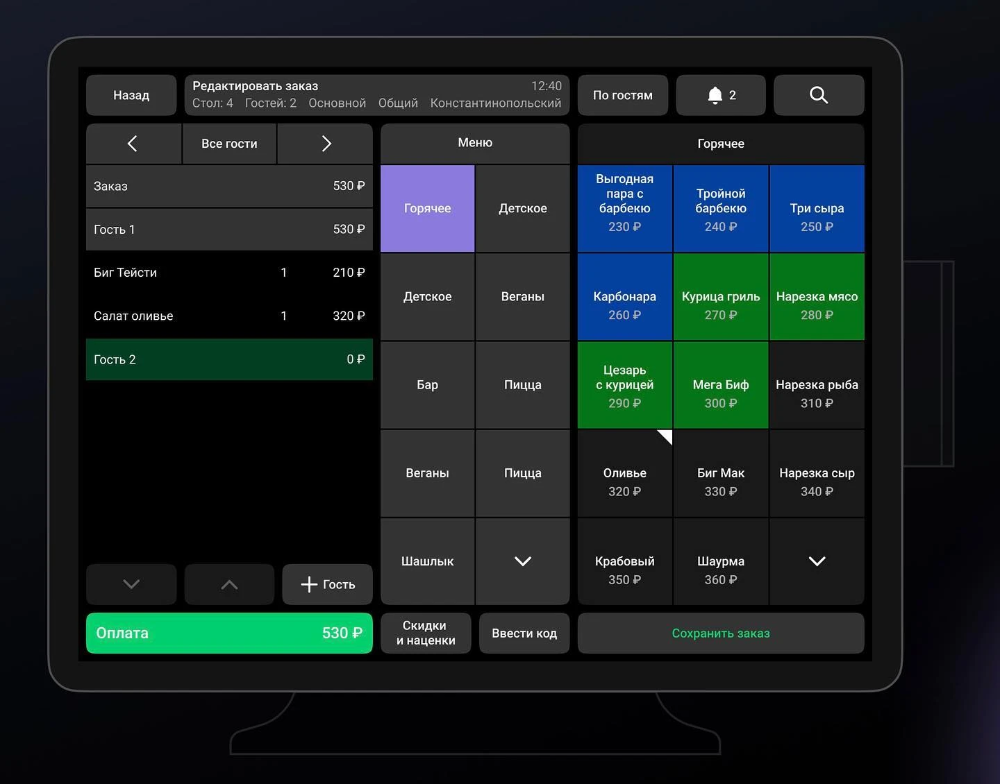

# temp-rep-team-1
Основной шаблон репозитория для командной разработки (описание меняем после применения шаблона)
-----
# Титульная часть

## Информация о себе:

- Название команды: TEAM
- Участники:
[Подробно](CONTRIBUTING.md)

## Про событие:

- Название хакатона:

- Кейс:

- Кейсодатель:

- Сроки:

- Формат участия:

----

# Содержание

- [Описание решения](#описание-решения)
- Архитектура решения
- Установка, настройка и запуск
- Примеры с интерфейсом*
- Примеры функционала*
- Планы на будущее
- Заключение

----

# Описание решения
...

# Архитектура решения

## Структура проекта:
```
===============
project/
|
| --- file_1/
|       |---
|
|
|
| -- LICENSE
| -- ...
|
==============
```
> Структура проекта

## Основные компоненты:
...

## Взаимодействие:
...

## Языки программирования:
...

## Технологии:
...

# Установка, настройка и запуск
!!!

# Примеры с интерфейсом*


...

# Примеры функционала*



...


...

# Планы на будущее
...

# Заключение
...
